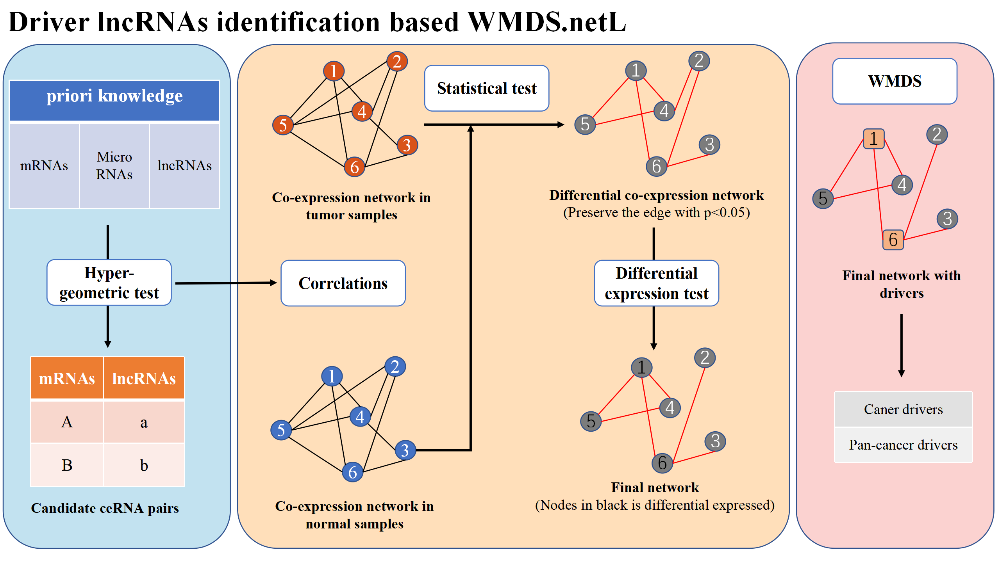

# WMDS.netL: Advanced Cancer-Driving LncRNA Identification

## What is WMDS.netL?

`WMDS.net` is an algorithm based on network control theory for identifying cancer driver genes. Compared with other methods and traditional differential gene statistical tests, `WMDS.net` offers higher accuracy, thereby reducing false positives (https://github.com/chaofen123/WMDS.net, https://doi.org/10.1093/bioinformatics/btad071). `WMDS.netL` is an improved and optimized version of `WMDS.net`, focusing specifically on the identification of cancer-driving lncRNAs during tumorigenesis and progression.

## What's in this Repository?

This repository includes the deployment code for `WMDS.netL` and related integration analysis codes. For the data used, if the file size meets GitHub's upload restrictions, it will also be included here (for files exceeding the size limit, acquisition methods will be provided). You can reproduce the results presented in our paper (to be published) using these codes. All codes are organized according to the sequence of figures in the paper, with brief comments at the beginning of each code file explaining its purpose and the final output.

## How to Run the Code

Our codes are primarily constructed using `MATLAB`, `R`, and `Python`. The deployment of the `WMDS.netL` algorithm is based on `MATLAB`, while the integration analysis is completed using `R` and `Python`. Additionally, the repository contains a packaged workflow for an `tissue distribution specificity` algorithm based on Shannon entropy and a `genomic conservation analysis` algorithm based on sliding windows, both of which can be conveniently utilized.

## Contact Us

We welcome anyone to use `WMDS.netL` for academic exploration in cancer biology, please cite our latest publication (to be published).

If you have any questions or would like to discuss ideas, feel free to contact us at: luo_itm@zju.edu.cn.

We are also very open to potential collaborations.