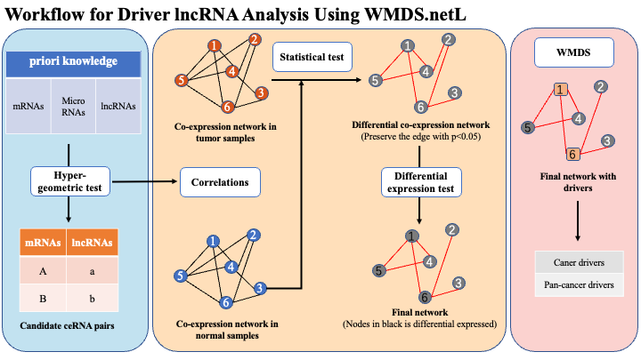
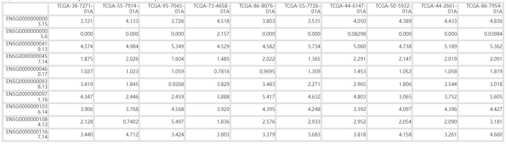

# WMDS.netL: Advanced Cancer-Driving LncRNA Identification

# Table of Contents

- [Introduction](#Introduction)
- [About](#About)
- [Usage](#Usage)
  - [Installation](#Installation)
  - [Run WMDS.netL](#Run-WMDS.netL)
- [Analysis](#Analysis)
- [System Information](#System-Information)
- [Contact](#Contact)

## Introduction

`WMDS.net` is an algorithm based on network control theory for identifying cancer driver genes. Compared with other methods and traditional differential gene statistical tests, `WMDS.net` offers higher accuracy, thereby reducing false positives (https://github.com/chaofen123/WMDS.net, https://doi.org/10.1093/bioinformatics/btad071). `WMDS.netL` is an improved and optimized version of `WMDS.net`, focusing specifically on the identification of cancer-driving lncRNAs during tumorigenesis and progression.


## About

This repository includes the deployment code for `WMDS.netL` and related integration analysis codes. For the data used, if the file size meets GitHub's upload restrictions, it will also be included here (for files exceeding the size limit, acquisition methods will be provided). You can reproduce the results presented in our paper (to be published) using these codes. All codes are organized according to the sequence of figures in the paper, with brief comments at the beginning of each code file explaining its purpose and the final output.

## Usage

The WMDS.netL algorithm is built via **MATLAB** and you can find it in `./code/WMDS.netL_algorithm/` where you can find the relevant source code as well as a priori data.

### Installation

```
git clone git@github.com:Luolattee26/WMDS.netL.git
cd WMDS.netL
conda env create -f environment.yml
conda activate lncRNA_W
```


### Run WMDS.netL

* After the installation is complete, you should make sure that **MATLAB** is installed on your machine.The `WMDS.netL` algorithm requires two input files, one for the normal expression matrix (TYPE_normal.txt) and the other for the tumor expression matrix (TYPE_tumor.txt). These two expression matrices should be located in `./data/` folder and each row is a gene, each column is a sample.
* After preparing the input file and setting up the runtime environment, please modify the value of the `cancer_type` variable in the `WMDS.netL` code located at `/code/WMDS.netL_algorithm/WMDS.netL.m`. Adjust the `cancer_type` variable to match the `TYPE` specified in your input files' name. Additionally, within the subsequent for loop (`for o=1:14`), ensure that the values are updated according to the specific type of cancer you wish to analyze.
* For an intuitive understanding of the required input data format, you may refer to the TCGA data provided by the Xena platform. 


You can run `WMDS.netL` by:
```
matlab -nodisplay -nosplash -r "run('code/WMDS.netL_algorithm/WMDS.netL');exit;"
```


## Analysis
If you are interested in our analytical approach or would like to reproduce our results, please refer to the section located at `./code/` folder.
* For each code file, we save the files in the order of Figure in the manuscript and mark them with the file name
* Some of the original data, as mentioned earlier, were not uploaded due to file size limitations, and you can refer to our manuscript for these data (all are publicly available)
* Some figures or panels use multiple code files for analysis and plotting, where the running order is labeled in the file name, as follows:
  - In Figure 3D, we used the phastCon score to calculate the conservatism of different lncRNA transcripts, and this analysis was done using several scripts
    1. First use `./code/fig.3/fig3.d_0_gtf2bed.sh` to prepare input file
    2. Then use `./code/fig.3/fig3.d_1_get_phastCon_res.py` to perform the analysis
    3. Finally use `./code/fig.3/fig3.d&e_plot_Con_TS.R` to plot the result
  - The number (0 and 1) in file name indicates the order in which the script is run 
  - A similar situation occurs with the following analysis: *Figure 3F, 4A, 4B, 6A, 6B*


## System Information


## Contact

We welcome anyone to use `WMDS.netL` for academic exploration in cancer biology, please cite our latest publication (to be published).

If you have any questions or would like to discuss ideas, feel free to contact us at: luo_itm@zju.edu.cn.
